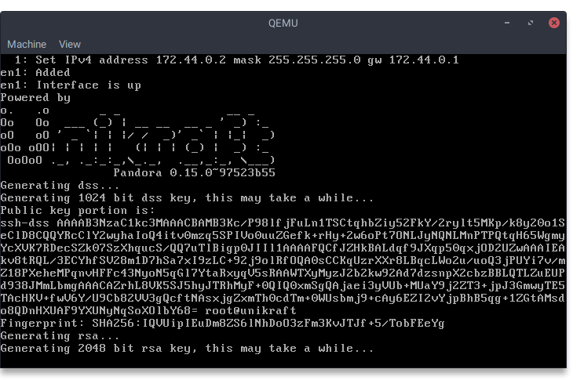

# unikraft-dropbear

This is a port of [dropbear](https://matt.ucc.asn.au/dropbear/dropbear.html), a small SSH suite, for [Unikraft](https://github.com/unikraft/unikraft).
Currently the app part and the library part is not separated and they both live in this repository.
For now this port only focuses on running the server part.



## Building the image

In order to build the image, you need a reasonably recent `gcc` compiler, `flex` and `bison` tools, `wget`, `python3` and `unzip`.

The build process involves selecting a `defconfig`.
Before starting the build process, you need to select a `defconfig`.
This can be done by running `UK_DEFCONFIG=$(pwd)/defconfigs/qemu-x86_64 make defconfig`.
Afterward you can run `make`.

If you're feeling lazy, there's a CI pipeline that builds the image for each push event.

## Running the image

The minimal QEMU invocation for running the image may look as follows:
```sh
qemu-system-x86_64 -kernel build/unikraft-dropbear_qemu-x86_64 -no-shutdown
```
The `-no-shutdown` parameter is useful for debugging, should the application crash.
Do note that this invocation will not set up networking so it is of little use for anything more than a smoke test.

An opinionated startup script is provided that can be used to "interrogate" the application using an SSH client on the host operating system.
Before running the script, make sure to set up the virtual network on the host operating system:
1. `sudo tunctl -t tap0 -u \`whoami\`` (this makes it possible to run the VM without elevated privileges)
2. `sudo ip addr add 172.44.0.1/24 dev tap0`
3. `sudo ip link set dev tap0 up`

Then, run `./dropbear-qemu-x86_64.sh`.
The application will generate the host keys and kick off the server.

## Limitations

Currently the only useful feature that works is local port forwarding.
Below is a non-exhaustive list of what **does not** work:
* the server runs in a non-forking mode -- it accepts and serves only one connection at a time.
	* at the moment it actually requires a restart as it runs the main function only once.
* PTY allocation always fails as (unsurprisingly) Unikraft does not implement pseudo-terminals.
	* therefore, always use the `-N` parameter when connecting using `ssh` so as not to request the PTY.

As you can see it is definitely not suited for production use.
However, it's a nice experiment that proves that it works.

## Why?

Why not?
I've always thought that the way we run bastion hosts was a little bit of an overkill.
You had `n` systems that you had to manage and keep keep them up-to-date.
With the bastion host entering the equation, you now have `n+1` of them.

If this gets to the stage where it has achieved feature-parity, performance and the security level known from traditional \*nix bastion hosts, I'll happily use it for accessing SSH hosts sitting behind a NAT.
